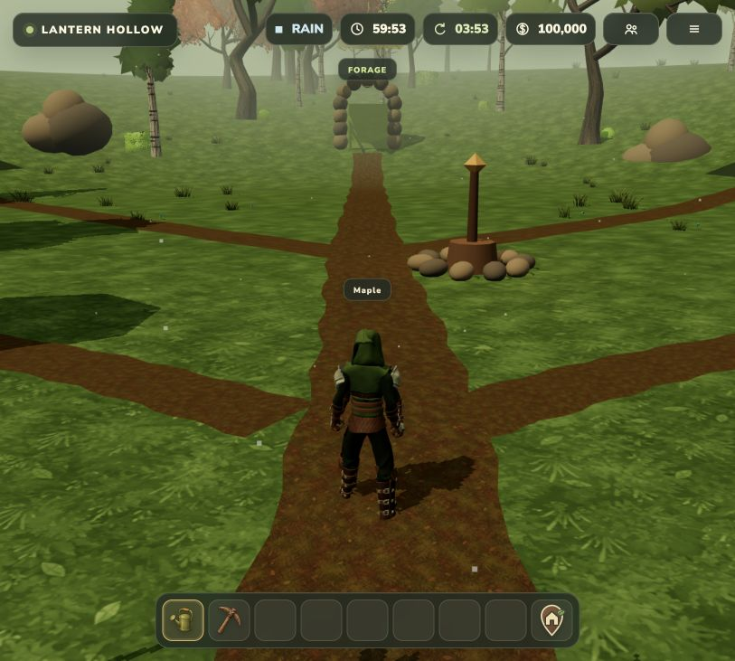
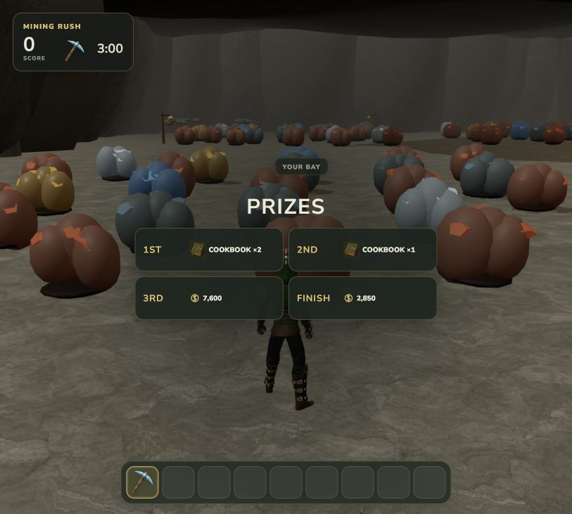

# Current visual reference set

These screenshots were captured from the current local production build on 2026-08-04. They are the visual source of truth for an external design review; older screenshots in ignored local artifact folders may show obsolete UI or balancing.

## Main world

### Hub

### Foraging area

### Mine entrance

### Farm area

## Minigames

### Mining Rush

### Farm Kitchen Rush

The images are evidence, not a request to preserve every visible choice. Review composition, readability, density, hierarchy, and cohesion alongside the live implementation and balance definitions.
